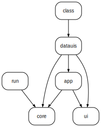

# purescript-interactive-data


Composable UIs for interactive data.


## Table of Contents

<!-- START doctoc generated TOC please keep comment here to allow auto update -->
<!-- DON'T EDIT THIS SECTION, INSTEAD RE-RUN doctoc TO UPDATE -->

- [Live Demo](#live-demo)
- [Features](#features)
- [Use cases](#use-cases)
- [Supported types](#supported-types)
- [Documentation](#documentation)
- [Getting started](#getting-started)
  - [Installation](#installation)
  - [Minimal complete example](#minimal-complete-example)
  - [Run](#run)
- [Limitations](#limitations)
- [Contributing](#contributing)

<!-- END doctoc generated TOC please keep comment here to allow auto update -->

## Live Demo

<a href="https://thought2.github.io/purescript-interactive-data/HalogenFullscreen">
  
</a>

[Halogen Fullscreen](https://thought2.github.io/purescript-interactive-data/HalogenFullscreen)

[React Embedded](https://thought2.github.io/purescript-interactive-data/ReactEmbed)

## Features

- **Framework agnostic**
  <br>
  _Can be embedded in any ReactBasic or Halogen app_
- **Configurable**
  <br>
  _UIs for each data type can be customized_
- **Extensible**
  <br>
  _UIs for any data type can be written in a simple MVC architecture_
- **Data validation**
  <br>
  _Data is validated on the fly and errors are displayed_

## Use cases

Any part of a web app that need to handle user input of nested structured data. E.g:

- Settings panel
- Back office tools
- User input forms

## Supported types

The following types are supported out of the box:

- Primitives like `String`, `Int`, `Number`, `Boolean`
- `Record`
- `Variant`
- Common ADTs like `Maybe`, `Either`, `Tuple`
- Newtypes
- Refinement of existing types (smart constructor pattern)
- Custom ADTs
- Generic Json inputs for not yet supported types

## Documentation

- [API docs on Pursuit](https://pursuit.purescript.org/packages/purescript-interactive-data)
- [Library Manual](docs/manual/Manual.md)

## Getting started

### Installation

1. Install the library

   ```
   spago install interactive-data
   ```

2. Install a virtual dom implementation, e.g. one of the following:

   ```
   spago install chameleon-halogen
   spago install chameleon-react-basic
   ```

3. Install a bundler, e.g.:

   ```
   npm in

### Minimal complete example

The following example renders with `Halogen`. Have a look at the demo folder for more examples in different frameworks.

<!-- START demoApp -->
*src/Main.purs:*
```hs
module Main
  ( main
  ) where

import Prelude

import Data.Maybe (Maybe(..))
import Effect (Effect)
import Effect.Class.Console (log)
import InteractiveData as ID
import Chameleon.Impl.Halogen as HI

main :: Effect Unit
main = do
  let
    -- 1. Compose a "Data UI" for a specific type
    --    (see demo/src/Demo/Common/CompleteSample.purs for more options)
    sampleDataUi = ID.record_
      { user: ID.record_
          { firstName: ID.string_
          , lastName: ID.string_
          , size: ID.number { min: 0.0, max: 100.0 }
          }
      , meta: ID.record_
          { description: ID.string_
          , headline: ID.string_
          }
      }

    -- 2. Turn "Data UI" into an App interface
    sampleApp =
      ID.toApp
        { name: "Sample"
        , initData: Nothing
        , fullscreen: true
        , showLogo: false
        }
        sampleDataUi

    -- 3. Create Halogen component
    halogenComponent =
      HI.uiToHalogenComponent
        { onStateChange: \newState -> do

            -- Use the `extract` function to get data out of the state
            log (show $ sampleApp.extract newState)
        }
        sampleApp.ui

  -- 4. Finally mount the component to the DOM
  HI.uiMountAtId "root" halogenComponent
```
<!-- END demoApp -->

We also need to create a simple html file and a `index.js` file to run the web app.

<!-- START demoHtml -->
*static/index.html:*
```html
<html>
  <head>
    <title>Interactive Data Sample</title>
  </head>
  <body>
    <script src="index.js" type="module"></script>
    <div id="root"></div>
  </body>
</html>
```
<!-- END demoHtml -->

<!-- START demoIndex -->
*static/index.js:*
```js
import { main } from "../output/Main/index.js";

main();
```
<!-- END demoIndex -->

### Run

```
spago build
parcel static/index.html
```

Go to http://localhost:1234

## Limitations

- No implementation for `Array` yet. This will be provided in the future though. Until then you can use the generic `Json` Data UI.
- Currently no support for recursive types.
- Data UIs cannot have side effects other than user input. A Data UI that fetches data from a server is currently not possible.

## Contributing

If you have ideas for improvements or want to contribute, please open an issue or PR.

The codebase is split into several local packages organized in a spago monorepo.

| Package name                             | Description                                                     |
| ---------------------------------------- | --------------------------------------------------------------- |
| [interactive-data-core][link-core]       | Core types that are used by most other packages                 |
| [interactive-data-app][link-app]         | UI for App layer that adds general navigation and data wrapping |
| [interactive-data-datauis][link-datauis] | UIs for specific data types                                     |
| [interactive-data-ui][link-ui]           | Reusable UI components                                          |
| [interactive-data-run][link-run]         | Machinery that turns data UIs into a regualar UI components     |
| [interactive-data-class][link-class]     | Type class for generic Data UI creation                         |

Due to a limitation of the current spago@next release local packages are not yet published separately. Instead they are published as a single package located in a generated [mirror repo](https://github.com/thought2/purescript-interactive-data.all).

To give you an idea of the package structure, here is a _Dependency graph of local packages:_



[link-core]: packages/interactive-data-core
[link-app]: packages/interactive-data-app
[link-datauis]: packages/interactive-data-datauis
[link-ui]: packages/interactive-data-ui
[link-run]: packages/interactive-data-run
[link-class]: packages/interactive-data-class
